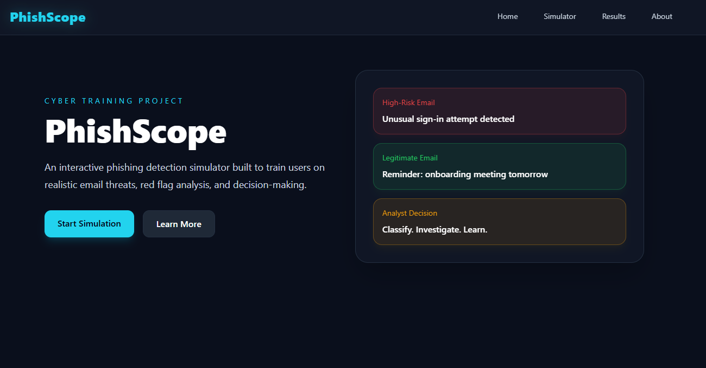
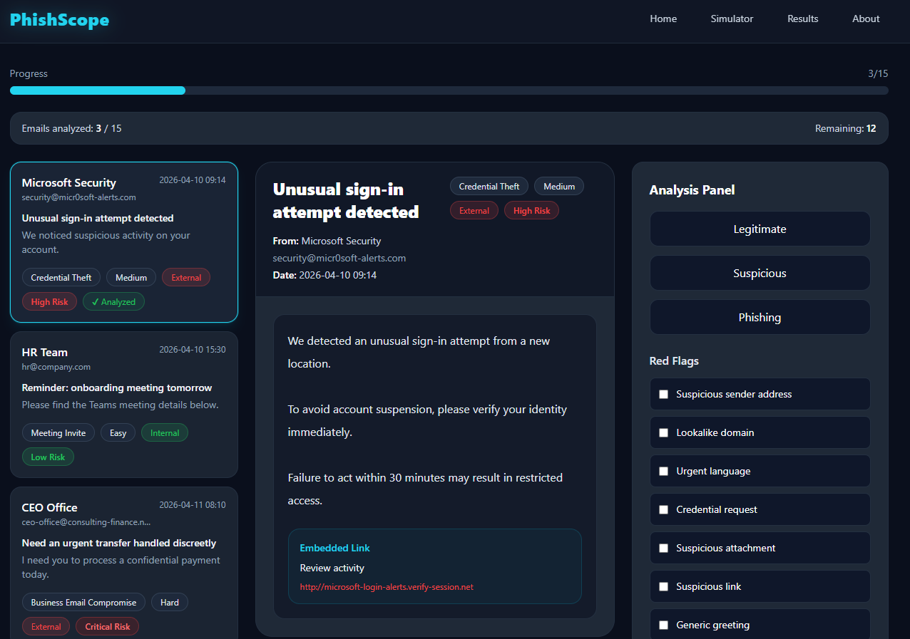
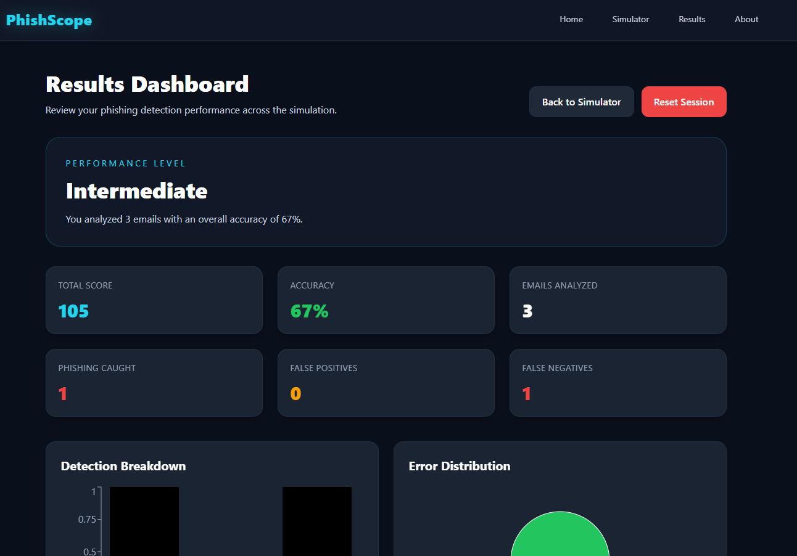

# 🛡️ PhishScope — Phishing Detection Simulator

🔗 **Live Demo**: https://phishscope.vercel.app/
📦 **Type**: Interactive Cybersecurity Training Tool
🎯 **Focus**: Phishing Detection & User Awareness

---

## 🚀 Overview

PhishScope is an interactive simulation platform designed to train users in identifying phishing emails through realistic scenarios.

Users act as a **SOC Analyst**, analyzing emails, identifying red flags, and making classification decisions under real-world conditions.

---

## 🎯 Key Features

- 📩 Realistic email inbox simulation
- 🧠 Decision system (Phishing vs Legitimate)
- 🚩 Red flag analysis (spoofing, urgency, malicious links, attachments)
- 📊 Dynamic scoring engine
- 📈 Performance dashboard with analytics
- 📉 Visual data insights (charts)
- 💾 Persistent session tracking (LocalStorage)
- 🎯 Skill level evaluation (Beginner → SOC Ready)
- 🎨 Modern cyber UI (Dark mode + animations)

---

## 🧪 Real-World Scenarios

This simulator includes multiple realistic attack patterns:

- Microsoft / Google login alerts
- Payroll & finance fraud attempts
- Fake DocuSign / SharePoint links
- IT support impersonation
- MFA reset attacks
- Banking fraud notifications
- Internal communication edge cases

---

## 🧠 What This Project Demonstrates

This project showcases:

### 🔐 Cybersecurity Skills

- Phishing detection logic
- Threat analysis mindset
- Social engineering patterns
- Blue Team thinking

### 💻 Technical Skills

- React architecture & state management
- Dynamic scoring systems
- Data visualization (Recharts)
- UI/UX design for training tools
- Component-based design
- Local data persistence

---

## 🖥️ Tech Stack

- ⚛️ React (Vite)
- 🎨 Tailwind CSS
- 🎞️ Framer Motion
- 📊 Recharts
- 💾 LocalStorage

---

## 📊 How It Works

1. User selects an email
2. Analyzes content (sender, tone, links, attachments)
3. Chooses a verdict (Phishing / Legitimate)
4. Selects detected red flags
5. Receives a score based on accuracy
6. Tracks performance in dashboard

---

## 📸 Screenshots

### 🏠 Home



### 📩 Simulator



### 📊 Results Dashboard



---

## 🧩 Project Architecture

```id="k1m2n3"
src/
├── components/
├── pages/
├── data/
├── utils/
```

---

## 🔮 Roadmap (V2)

- 🔍 Advanced analyst mode (email headers, SPF, DKIM)
- 👤 User authentication & profiles
- 🧠 Adaptive difficulty system
- 🏆 Gamification (badges, streaks)
- 🌐 Backend integration (API / database)
- 📚 Scenario generator

---

## 👤 Author

Kevin (Inkedi9) — Cybersecurity Enthusiast  
🔗 https://github.com/Inkedi9

---

## ⭐ Why This Project Matters

Phishing remains one of the **top attack vectors worldwide**.

PhishScope focuses on **practical detection skills**, simulating what a SOC analyst or security team would actually face.

---

## 🧠 Recruiter Note

This project demonstrates:

- Ability to design interactive security tools
- Understanding of real-world attack patterns
- Strong frontend + product thinking
- Attention to UX and learning experience

---

💡 _Built as part of a cybersecurity portfolio to demonstrate practical, job-ready skills._
